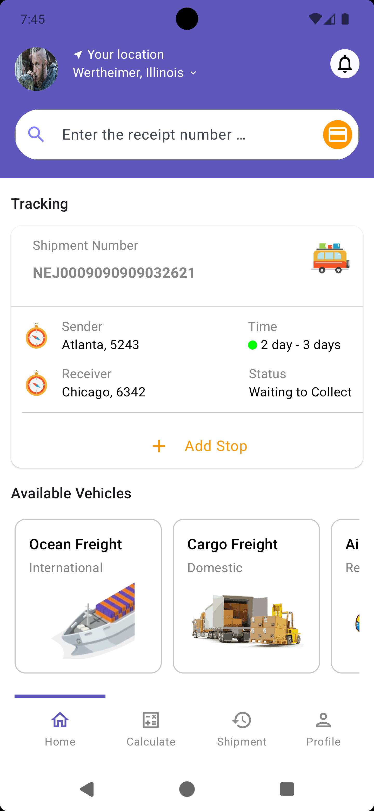
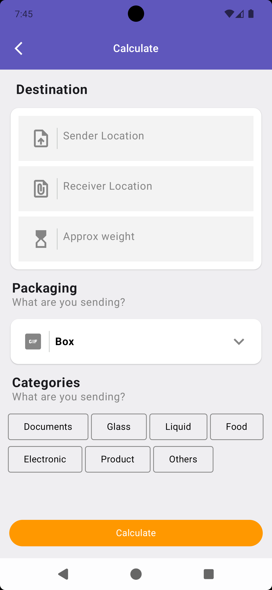
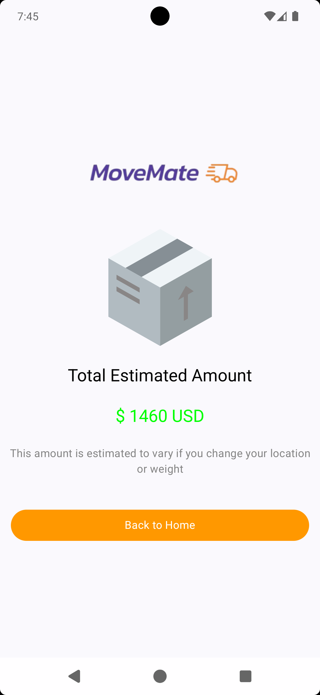

## MoniePoint Android Engineer Interview Solution

*Summary*
A translation design application that precisely replicates the animations, scroll behavior, and page layouts from a mock-up design provided by a Sample Dribble Design. The application ensures an exact match in user interface and experience, mirroring the original design's look and feel.

The final app looks like this:👀

## 🌚 Screenshots(Dark)
| Home Screen                       | Calculate Up                           | Shipment Screen                      | Pricing Screen                                                                                                 |
|-----------------------------------|----------------------------------------|--------------------------------------|----------------------------------------------------------------------
|  |  |  | ) 


# LICENSE

```
   Copyright 2024 Caleb langat

   Licensed under the Apache License, Version 2.0 (the "License");
   you may not use this file except in compliance with the License.
   You may obtain a copy of the License at

       http://www.apache.org/licenses/LICENSE-2.0

   Unless required by applicable law or agreed to in writing, software
   distributed under the License is distributed on an "AS IS" BASIS,
   WITHOUT WARRANTIES OR CONDITIONS OF ANY KIND, either express or implied.
   See the License for the specific language governing permissions and
   limitations under the License.

```
